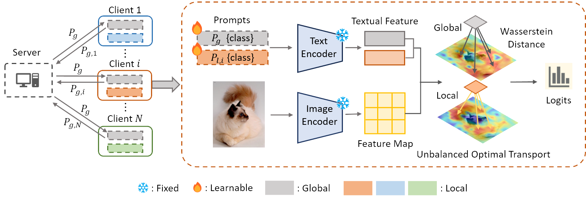

# Global and Local Prompts Cooperation via Optimal Transport for Federated Learning [CVPR2024]
The implementation of paper **Global and Local Prompts Cooperation via Optimal Transport for Federated Learning (CVPR2024)**.[paper](https://arxiv.org/pdf/2403.00041.pdf)


## Requirements
- Python 3.8+
- Pytorch 1.10.0+

To install requirements:
```
pip install -r requirements.txt
```

## Data Preparation
Please follow the instructions at [dataset.md](dataset.md) to prepare the following datasets: Caltech101, OxfordPets, Flowers102, Food101, DTD.

For CIFAR10 and CIFAR100 datasets, please download and unzip data under `DATA/` file catalog. Or simply run experiments with CIFAR10/CIFAR100 dataset, the program will download data automatically.

For DomainNet and office-caltech10 datasets, please follow the instructions of Dataset described [here](https://github.com/med-air/FedBN/blob/master/README.md). 

## How to Run

You can run `federated_main.py` with some specified arguments.

### Training

`--root` takes as input a path to dataset, like `caltech101` or `oxford_flowers`.

`--config-file` means which config file to use, such as `rn50` or `vit_b16`.

You can select variables like shots, clients by changing `cfg` or you can change every arguments you like in `fedotp_few_shot.sh`.

### For example
If you want to use FedOTP to train caltech101 dataset with 2 shots, backbone rn50 and total independent non-iid setting.
You can specify that:
```
MODEL=FedOTP
TRAINER=GLP_OT
DATA=caltech101
SHOTS=2
USEALL=False
IID=False
```
and run `bash scripts/fedotp_few_shot.sh`

After the experiments, all the results are finished and save to `output/`.

We build and modify the code based on Dassl and CoOp. 
